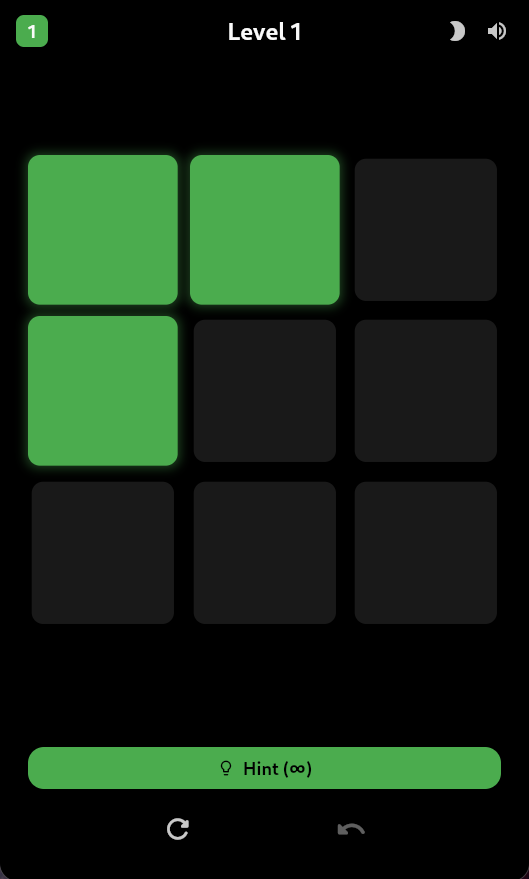
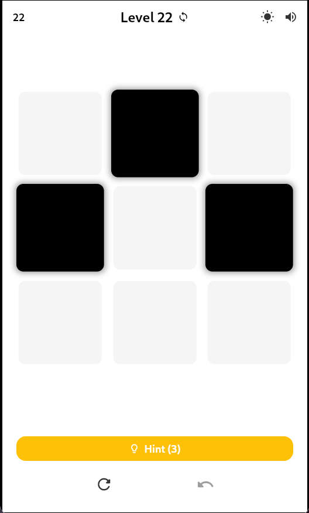
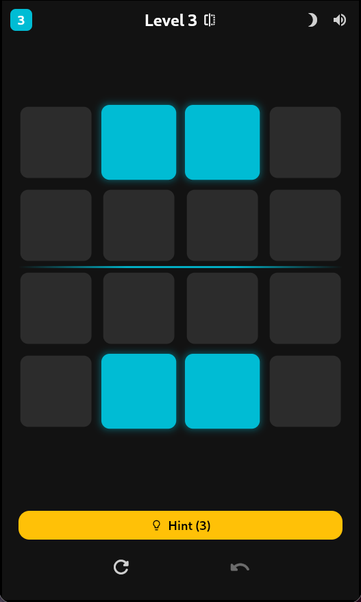
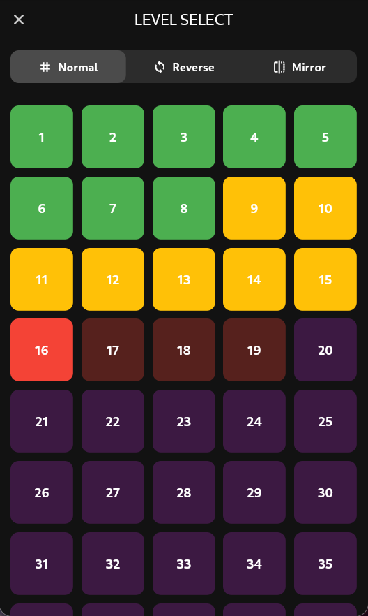
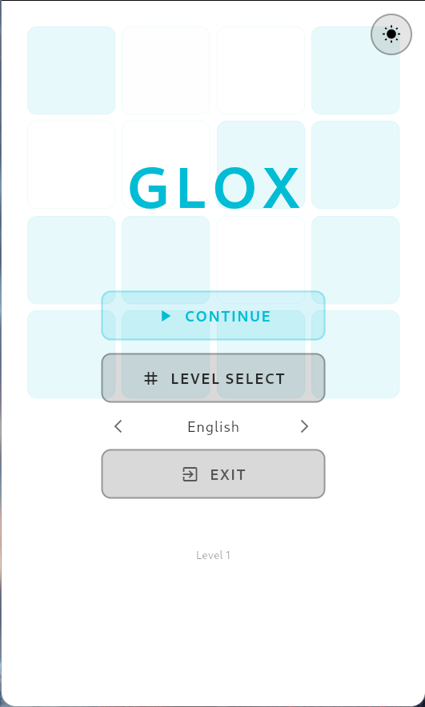

<div align="center">


# GLOX 🎮

**A modern, minimal mobile puzzle game inspired by GNOME Lights Off, built with Flutter.**

---

## ✨ Features

<p align="center">
  
  
  
  
  
</p>

- 🧩 **Classic Lights Off mechanics** - Tap a tile to toggle it and its 4 neighbors
- 🧠 **Smart hint system** - Optimal solutions using Gaussian elimination over GF(2)
- 🌗 **AMOLED & White themes** - Pure black or clean white with custom accent colors
- ✨ **Modern animations** - Smooth scale effects, color transitions, and glow
- 📱 **Responsive design** - Adapts to any screen size
- 🎨 **Material 3 UI** - Contemporary design with rounded tiles
- 📈 **Infinite levels** - Procedurally generated challenges

---

## 🎯 About

GLOX is a sleek puzzle game where you tap tiles to toggle them and their neighbors, with the goal of turning all tiles OFF. Features intelligent hints powered by linear algebra, customizable themes, and smooth animations.

---

## 🚀 Quick Start

```bash
# Clone or navigate to the project
cd glox

# Install dependencies
flutter pub get

# Run on device/emulator
flutter run

# Build APK
flutter build apk
```


## 🎮 How to Play

1. **Objective**: Turn all tiles OFF (dark color)
2. **Mechanic**: Tapping a tile toggles it + top, bottom, left, right neighbors
3. **Hint**: Press the hint button to see the next optimal move
4. **Progress**: Complete levels to unlock more challenging puzzles
5. **Customize**: Toggle theme and pick your favorite accent color

## 🏗️ Architecture

```
lib/
├── main.dart           # App entry & provider setup
├── models/             # Data models (GameState, ThemeConfig, Level)
├── logic/              # Game logic (toggle mechanics, GF(2) solver)
├── widgets/            # UI components (tiles, grid, controls)
├── screens/            # Game screen
└── themes/             # Material 3 theme definitions
```

## 🧪 Testing

```bash
# Run tests
flutter test

# Analyze code
flutter analyze
```

All tests passing ✅ | Zero lint warnings ✅

## 🎨 Themes

- **AMOLED Dark**: Pure black background (#000000) with vibrant accents
- **White**: Clean white background (#FFFFFF) with subtle contrast
- **Accent Colors**: Fully customizable via color picker

## 🧠 Hint Algorithm

The hint system uses **Gaussian elimination over GF(2)** (binary field):
1. Models the puzzle as a system of linear equations mod 2
2. Constructs coefficient matrix where A[i][j] = 1 if button j affects tile i
3. Solves A×x = b (mod 2) using row reduction
4. Returns optimal move sequence

## 📦 Dependencies

- `provider: ^6.1.1` - State management
- `flutter_colorpicker: ^1.0.3` - Color customization

## 🎯 Tech Stack

- **Flutter** (stable channel)
- **Dart 3.0+**
- **Material 3** design
- **Provider** pattern for state management
- Clean architecture with separation of concerns

## 📝 License

This project was created as a demonstration of modern Flutter game development.

## 🙏 Credits

Inspired by GNOME Lights Off, reimagined with modern Flutter UI/UX.

---

**Game Name**: GLOX  
**Type**: Puzzle  
**Platform**: Android, Linux, Windows 
**Framework**: Flutter
